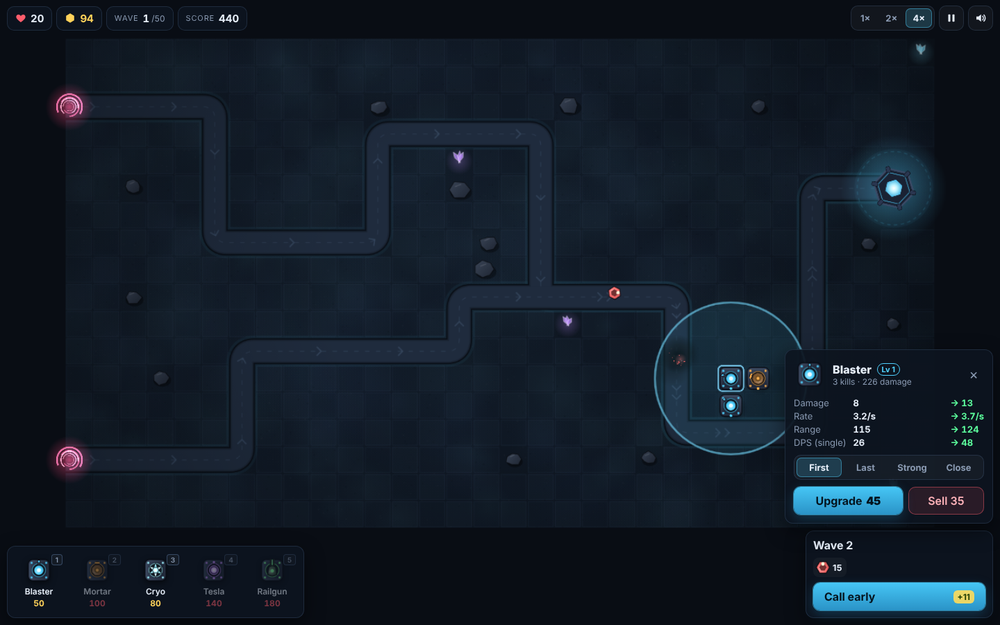
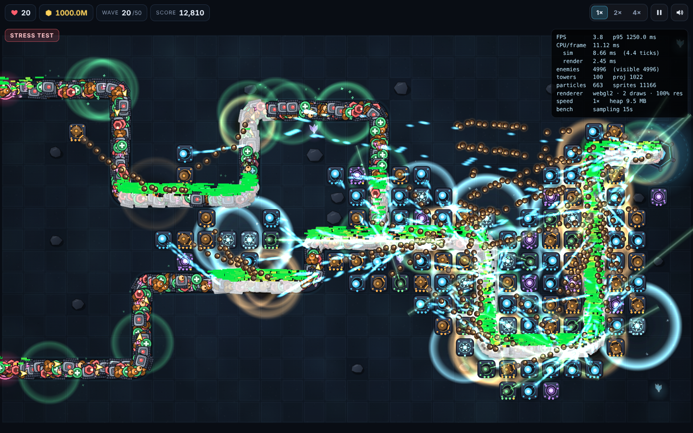

# Bastion

A browser tower defense game. You hold a core against 50 waves of enemies on two maps and three difficulties. It is plain JavaScript with no dependencies and no build step, and it never touches the network.

**Run it:** open `index.html` in a browser (it works from `file://`). You can also run `npm start` and go to <http://localhost:8080>, or open the single-file build in `dist/bastion.html`.



## The game

| | |
|---|---|
| **Towers (5)** | **Blaster**: cheap and fast-firing, but weak against armour. **Mortar**: splash shells. **Cryo**: area slow pulse. **Tesla**: chain lightning that ignores half of armour. **Railgun**: a long piercing beam that ignores all armour. Each tower has 4 levels and 4 targeting modes (first, last, strong, close). Selling refunds 70%, or 100% within 3 seconds of building. |
| **Enemies (7 + spawnling)** | **Grunt**. **Runner** (fast). **Swarmling** (comes in large clouds). **Juggernaut** (armour that grows each wave). **Mender** (heals nearby enemies). **Splitter** (breaks into 3 spawnlings). **Behemoth** boss on waves 10/20/30/40/50, which resists slows and summons swarms. |
| **Waves** | 50 waves from a seeded generator. Enemy HP grows roughly quadratically, wave budgets grow, and new enemy types appear on waves 3, 5, 7, 11 and 14. There are themed waves (swarm floods, armoured columns, runner rushes) and a boss every 10th wave. Calling a wave early pays bonus credits. |
| **State** | Lives, credits, score (kills, wave clears and a victory bonus), best score per map and difficulty, and victory and defeat screens. |
| **Controls** | Pause, restart, and speeds 1×/2×/4×. Pan and zoom with mouse, touch (pinch) or keyboard. `1–5` build, `U` upgrade, `X` sell, `T` targeting, `N` next wave, `Space` pause, `F` speed, `` ` `` performance overlay. Touch uses tap-to-preview, then tap to confirm. On portrait phones the camera turns 90° so the map fills the screen. |
| **Extras** | AI demo mode (the bot plays, and you can help). Built-in **Stress test** with a results screen. Synthesized WebAudio sound effects. |

Balance was tuned with a headless bot over every map and difficulty (`npm run balance`). On Veteran, a competent build with upgrades and mixed towers wins, often losing lives on the final boss. Builds with no upgrades lose around wave 20, and a Blaster-only build loses in the 40s. Warlord is tight even for the bot.

## Architecture

```
js/core/      DOM-free; runs unchanged in Node for tests
  util.js     namespace, seeded RNG (mulberry32), colour packing
  data.js     tower/enemy/difficulty/map tables, HP curves, wave generator
  map.js      tile grid + smoothed paths sampled into lookup tables
  sim.js      the simulation (fixed 60 Hz step)
  bot.js      autoplay AI (demo mode, balance tests, long-run test)
  stress.js   fixed-step loop driver + the stress scenario
js/render/    atlas.js (procedural sprites), background.js, renderer.js (WebGL batcher), scene.js
js/game/      fx.js (particles etc.), audio.js, input.js, ui.js (DOM HUD), main.js (loop, camera, modes)
tools/        headless.mjs, bench.mjs, longrun.mjs, smoke.mjs, build.mjs
```

* **One loop.** A single `requestAnimationFrame` drives everything. There are no per-entity timers. Each frame feeds real elapsed time × game speed into an accumulator (`FixedLoop`). The accumulator steps the sim in fixed `1/60 s` ticks, up to 12 per frame, and drops any extra backlog so a stall can't spiral. Rendering interpolates enemy and projectile positions between the last two ticks (`alpha`), so motion stays smooth at 30, 60, 144 or 240 Hz.
* **Deterministic sim.** All gameplay randomness comes from a seeded RNG. Player and bot commands apply between ticks. `headless.mjs determinism` drives the same game through the browser's loop code at 30, 60, 144 and 240 Hz and at 60 and 75 Hz with ±60% / ±30% frame jitter. The state hash is identical at every checkpoint, so behaviour does not depend on refresh rate.
* **Data-oriented state.** Enemies and projectiles live in preallocated typed arrays (structure of arrays):
  * Enemies use stable slots, a free-list stack and a dense active list with O(1) swap-remove. Uids guard against reused slots.
  * Projectiles use dense arrays with swap-remove.
  * Towers (at most one per tile) are plain objects.
* **Spatial hash.** A uniform 40 px grid is rebuilt every tick with a counting sort, which is O(n), allocation-free and leaves each cell's enemies contiguous. Every range query uses it: tower targeting, splash, chain jumps, rail lines, healer pulses and render culling.
* **Paths.** Waypoints are corner-rounded and resampled every 2 px into position, tangent and angle tables. Moving an enemy is `dist += speed·dt` plus one table lookup, and a per-enemy lateral offset spreads crowds across the lane.
* **Sim ↔ presentation.** The sim emits side effects through an `fx` hook object (`death`, `explosion`, `arc`, …). In Node it is a no-op, and in the browser it feeds particles and sound. The DOM HUD reads sim state, caches every value and only touches the DOM when a value changes.

## Rendering approach

* **WebGL2 instanced sprite batcher**, falling back to WebGL1 + `ANGLE_instanced_arrays`, then to Canvas2D. Each sprite is one instance of 11 floats (`x y w h rot u0 v0 u1 v1 rgba flash`) in one interleaved buffer, uploaded with a single `bufferSubData`.
* **Two draw calls per frame:** one textured quad for the pre-rendered map background, and one instanced call for every other sprite.
* **One texture.** All sprites (enemies, tower bases and 4 turret levels each, projectiles, particles, glyphs for floating numbers) are drawn procedurally with Canvas2D at start-up into a 2048² atlas. UI icons and map thumbnails are made from the same atlas.
* **No blend-state switches.** Colours are premultiplied, so a tint with alpha 0 blends *additively* in the same pass (glows, beams, sparks), and painter's order is kept without sorting or state changes.
* **Shader tricks that save quads.** A hit flash is a per-instance `flash` value that mixes the texel toward white (no white-silhouette overlay sprite). A health bar is a single quad: a negative `flash` encodes the fill fraction, and the fragment shader draws fill plus background.
* **Culling.** Enemies are visited only through spatial-grid cells that overlap the camera rectangle. Projectiles, towers and particles are bounds-checked before queueing. Off-screen objects add no GPU work and almost no CPU work.
* **Dynamic resolution.** If frames run long while CPU work is a small share of the frame (GPU-bound), the backing resolution drops in 10% steps to 50%. It recovers when there is headroom. If a step doesn't help (for example a browser capping frames at 30 Hz), it reverts and stops.
* **Effects** use fixed-size ring buffers (6 144 particles, 640 beams/arcs, 320 rings, 96 decals, 96 popups) plus a per-frame emission budget. An effect storm overwrites the oldest effects and never grows memory.

## Performance

### Major bottlenecks (found by measuring)

1. **Target acquisition.** At first, each tower scanned candidate enemies. This was solved with the spatial grid and acquiring targets only when a tower is ready to fire. Towers keep their target between shots for aiming, and idle towers back off for 5 ticks when nothing is in range. `findTarget` is still the top sim function in profiles.
2. **Per-sprite GPU overhead.** With 5 000 enemies, instance count and fill drive GPU cost. This was solved with one draw call, tight sprite bounds, single-quad health bars, flash in the shader instead of an overlay quad, and single-quad bolts.
3. **Compositing of translucent DOM over the canvas.** `backdrop-filter: blur` on HUD panels forced the compositor to re-blur the changing WebGL canvas every frame. In software compositing this alone took frames from 17 ms to 400 ms. The blur was removed in favour of near-opaque panels.
4. **Catch-up spiral.** When frames are slow the sim must run several ticks per frame. This is capped at 12 ticks, after which backlog is dropped, the game slows slightly rather than freezing, and interactivity is kept.
5. **Allocation and GC.** Steady-state frames allocate nothing: typed-array pools, reused closures and camera objects, numeric colour packing, and digit glyphs computed arithmetically instead of strings.

### Measurements

All numbers are from this development container. It has **2 vCPUs and no GPU**: Chromium's WebGL runs on a software rasteriser, either SwiftShader or Mesa llvmpipe. The CPU side can be measured accurately here. The GPU side cannot represent real hardware, so it is reported separately and honestly.

**Stress scenario** (`?stress`, or **Stress test** in the menu): 100 towers, 5 000 live enemies and ≥ 1 000 live projectiles at all times. Dead enemies are replaced, enemies that reach the base are recycled, and the global fire rate is steered so live projectiles stay at 1 000–1 150.

| Measurement (stress scenario, Chromium 141, 1920×1080) | Result |
|---|---|
| CPU per 60 Hz frame (sim tick + fx + full scene build), 1 800 frames, `npm run bench:cpu` | avg **2.39 ms**, p50 2.3, p95 **3.0 ms**, p99 5.4, max 10.9 |
| …frames whose CPU work exceeded 22.2 ms (45 FPS) / 33 ms | **0 / 0** |
| …of which simulation (5 000 enemies / 100 towers / ~1 070 projectiles) | avg 1.23 ms, p95 1.7 ms per tick |
| …of which scene build (≈ 16 000 sprites queued) | avg 1.16 ms, p95 1.3 ms |
| Sim tick alone in Node (`npm test`) | median 0.97 ms, p95 1.5 ms |
| Draw calls per frame | 2 |
| Culling: sprites queued at fit / 2× / 4× zoom | 10 697 / 5 218 / 2 739 (visible enemies 4 987 / 2 557 / 1 043) |
| Real rAF frame rate in this container (software GPU) | SwiftShader ≈ 1–2 FPS. llvmpipe 7 FPS, or 16.6 FPS once dynamic resolution settles at 50%. Main thread is ≥ 90% idle (CPU profile), so these frames are GPU-bound. |

**How to read this:** the game's own work for a stress frame is about 2.4 ms, roughly 10% of the 22 ms budget for 45 FPS, and p99 is 5.4 ms. What remains is GPU work: two draw calls and about 11–16 k small textured quads per frame. Any discrete or integrated GPU handles this in a few milliseconds. A software rasteriser on 2 vCPUs can't; even an empty 1 000-sprite test page runs at 30 FPS on SwiftShader here. I could not measure the 45 FPS / 33 ms targets on real graphics hardware from this container. To verify them on a real machine:

* Open the game and press **Stress test**. After a 3 s warm-up it samples every `requestAnimationFrame` for 20 s. It then shows average FPS, **% of frames at ≥ 45 FPS**, **% of frames over 33 ms**, p50/p95/p99 frame time, CPU split and heap, with pass/fail marks against the targets.
* Or run `npm run bench:gpu`, which uses headed Chromium with the real GPU and prints the same JSON. Use `node tools/bench.mjs` for the software-rasteriser defaults used here.

**Interactivity under stress:** input handlers run on events, not in the frame loop, and the HUD is DOM. Pause, speed, selection, upgrades and camera work during the stress test, and the dynamic-resolution step keeps weak GPUs responsive.

**Memory over a complete 50-wave run:**

| Test | Result |
|---|---|
| Node, full game (bot, Recruit), heap after forced GC each wave (`npm test`) | 4.22 MB at wave 1 → 4.64 MB at wave 50. The growth is the ~60 tower objects built. |
| Chromium, full 50-wave game (AI autoplay at 32×, Veteran) with CDP heap sampling after forced GC (`npm run longrun`) | Run ends in victory. JS heap 1.68 MB at wave 5, peak 1.99 MB, 1.79 MB at the victory screen; DOM nodes (≈585) and listeners (55) constant. Raw samples are in `tools/longrun-result.json`. |

Entity pools are fixed-size typed arrays allocated once per battle (about 1.5 MB), so memory doesn't scale with enemy counts.

**Refresh-rate independence:** `npm test` includes the determinism check described above. The state at ticks 600, 3 600, 18 000 and 36 000 is bit-identical across 30/60/144/240 Hz and jittered frame pacing.

Stress scenario as rendered (5 000 enemies, 100 towers, ~1 000 projectiles):



### Reproduce

```
npm test                  # determinism, 50-wave memory, sim stress (Node only)
npm run balance           # bot plays every map × difficulty × strategy
npm run bench:cpu         # CPU frame budget in Chromium (needs playwright)
npm run bench             # full rAF benchmark (software GPU in containers)
npm run bench:gpu         # same, headed, on your real GPU
npm run longrun           # 50-wave browser run with heap sampling
npm run build             # dist/bastion.html single-file build
```

Useful URL flags: `?stress`, `?autoplay&turbo=16`, `?canvas2d` (force fallback), `?nodrs`, `?lockstep`.
